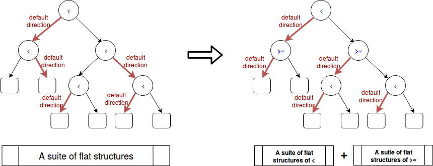

# AdaQS: Adaptive QuickScorer for Sparse Data and Regression Trees with Default Directions

This repository discusses fast rank techniques using additive ensembles of regression trees.
The discussions are restricted only in academic scope with some theoretical and experimental analysis. The commercial 
use of our contributions are not allowed.

## Introduction

Quickscorer[^1] is a fast algorithm to rank documents with additive ensembles of regression trees. To efficiently score a document of features,
rather than searching along individual trees in depth first manner as the conventional approaches do[^2], quickscorer transforms the trees into a suite of flat structures and searches in them along the features. The experiments show that quickscorer achieves more than 2x speedups over the previous methods.

However it is non-trivial to adapt quickscorer to regression trees with default directions trained by XGBoost library[^3] which is used widely by data scientists to achieve state-of-the-art results
on many machine learning challenges. This means when a feature value is absent in a sparse data instance, the instance is classified into the predefined default directions (either left child or right child) by the tree nodes the split conditions of which are determined by this absent feature. The invention of default direction is an elegant solution to handle all sparsity patterns (e.g., missing values and one hot encoding) in a unfied way and boost the training process extremely fast.

This repository extends the work of quickscorer by proposing a novel adaptive algorithm (i.e., AdaQS) for sparse data and regression trees with default directions as trained by XGBoost. The experiments show that our algorithm achieves intensively better performance than a straightforward extension of quickscorer (i.e., PlainQS) to meet this problem setting.

The contributions of this repository are as follows.

(1) We propose a novel AdaQS algorithm to rank sparsely represented documents with additive ensembles of regression trees with default directions. The experiments show that our proposed algorithm achieves intensively better performance than a straightforward extension of quickscorer.

(2) We implement an efficient C++ library of AdaQS algorithm which loads XGBoost format model (both binary format and dump format) and predicts scores for sparse data sets (e.g., libsvm format). This library is used only for experimental analysis 
and is made unavailable to commercial use.

(3) We also propose to speedup prediction process with empirical condition distributions statistically inferred from a historical data set. 

## QuickScorer in Brief

Given a GBDT or LtR model with a set of regression trees, quickscorer encodes each tree node with a bitvector. For an input instance, it divides the tree nodes into true nodes and false nodes based on the instance's Boolean condition evaluation on them. The proposed encoding mechanism induces that the leftmost one bit of logical AND of all the false nodes' bitvectors for each tree implies its exit leaf.

Quickscorer transforms the trees into a suite of flat structures and searches in them along the features. This strategy saves a lot of repetitive comparisons in the previous methods that search along individual trees in depth first manner. When the number of trees grows large, the improvement is very significant.

## Regression Trees with Default Directions

XGBoost proposes to model data sparsity with default directions of regression trees. It adds a default direction in each tree node to handle sparse data with absent feature values. 

This strategy is obviously reasonable for missing values implemented as the NaN type of IEEE 754 floating-point standard. In the above situation, it is possible for the tree nodes with these split features to be either true nodes or false nodes. In situations of one-hot encoding or zero entries in the statistic, the zero value definitely goes left which always implies true nodes. 

Since we only concern with false nodes which participate in computation of exit leaves we have to deal with the tree nodes with default directions going right.

## PlainQS: a straightforward but inefficient approach

A straightforward idea is to extend quickscorer by enumerating all the node encodings with default directions going right and calculating the bitwise logical AND of them for each feature of each tree in advance. We store the calculated partial bitvectors for later use.

When a sparse instance queries the score, in addition to search and calculate result bitvectors as quickscorer does normally, we also have to integrate the previously calculated partial bitvectors into the bitwise logical AND operation for each tree.

We call this approach as PlainQS algorithm. This additional process cost a lot of execution time and memory storage.

## AdaQS: an efficient approach

We propose AdaQS, a novel adaptive algorithm for sparse data and regression trees with default directions. For each tree node with default direction going right, we adaptively swap its left child and right child. The swap operation is to ensure every default direction going left, thus the absent features of sparse data lead to no false node.

However the swap has side effect that changes the Boolean condition from '<' (less than) operation to '>=' (more than or equal to) operation. To preserve the efficiency of quickscorer's search strategy we transform the regression trees into two separate suites of flat structures. One corresponds to the tree nodes with '>' operation and the other corresponds to the tree nodes with '<=' operation. When a sparse instance queries the score, we search in both the two suites and integrate the results.

## Speedup with Empirical Condition Distributions

In case we have priori knowledge that some features will always be present in instances (i.e., the default directions never apply), we can adopt the above adaptive swap strategy to those corresponding tree nodes. The decision of whether to swap or not depends on the satisfaction of keeping the probability of going left greater than going right according to empirical condition distributions statistically inferred from a historical data set. This approach will reduce the number of false nodes as to reduce the number of bitwise logical AND computations.

## Experimental Evaluations

We conduct the experiments on the public data set of [Avazu's Click-through Prediction](https://www.csie.ntu.edu.tw/~cjlin/libsvmtools/datasets/binary.html#avazu). The models with different number of trees are trained by XGBoost with parameters of max_depth = 6, eta = 1.0, gamma = 1.0 and min_child_weight = 1. The below table shows the experiment results of running time of different algorithms. AdaQS achieves intensively better performance than the other algorithms. The readers can replay the experiments by executing 'bash app/script/eval_time.sh' after building the release version of executable files.

| number of trees | xgboost predictor | Struct | PlainQS | AdaQS |
| :---: | :---: | :---: | :---: | :---: |
| 10 | 0.0200775 ms | 0.00104797 ms | 0.020088 ms | 0.000386031 ms |
| 50 | 0.0629046 ms | 0.00575637 ms | 0.0629062 ms | 0.000665116 ms |
| 100 | 0.121291 ms | 0.0119725 ms | 0.121875 ms | 0.00101702 ms |
| 500 | 0.641165 ms | 0.0690897 ms | 0.655184 ms | 0.00368209 ms |
| 1000 | 1.22905 ms | 0.144676 ms | 1.15541 ms | 0.00681473 ms |
| 2000 | 2.34709 ms | 0.532168 ms | 2.82585 ms | 0.0126754 ms |
| 5000 | 5.67347 ms | 1.53553 ms | 6.67661 ms | 0.0331735 ms |

## Conclusions

We proposed to fast rank sparse represented documents using regression trees with default directions (e.g., models 
trained from XGBoost). A novel adaptive algorithm (AdaQS) is proposed to technically solve this problem. The experiments show that 
our algorithm achieves intensively better performance than a straightforward approach (i.e., PlainQS). We also 
proposed to speedup prediction process with empirical condition distributions statistically inferred from a historical data set. All the above 
discussions are restricted only in academic scope. The commercial use of our contributions are not allowed.

[^1]: Lucchese, C., Nardini, F. M., Orlando, S., Perego, R., Tonellotto, N., and Venturini, R. QuickScorer: Quickscorer: a fast algorithm to rank documents with additive ensembles of regression trees. In SIGIR ’15: Proceedings of the 38th International ACM SIGIR Conference on Research and Development in Information Retrieval (2015). 

[^2]: N. Asadi, J. Lin, and A. P. de Vries. Runtime optimizations for tree-based machine learning models. IEEE Trans. Knowl. Data Eng., 26(9):2281–2292, 2014.

[^3]: Tianqi Chen and Carlos Guestrin. XGBoost: A Scalable Tree Boosting System. In 22nd SIGKDD Conference on Knowledge Discovery and Data Mining, 2016.